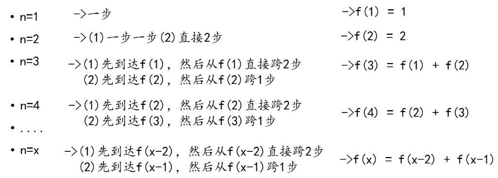
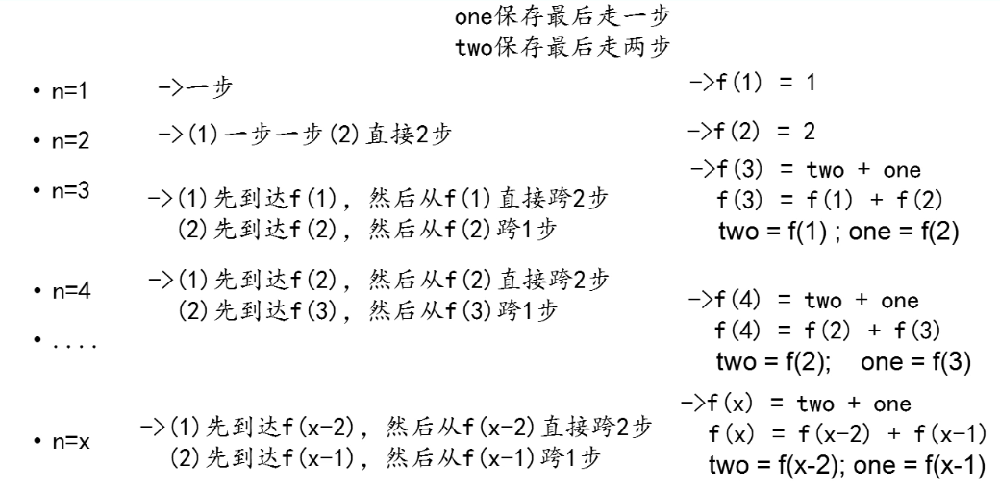

## 爬楼梯

一只青蛙一次可以跳上 1 级台阶，也可以跳上 2 级。求该青蛙跳上一个 n 级的台阶总共有多少种跳法。

### 递归

> 分析过程



> 案例代码

``` java
/**
 * 递归的写法
 */
public class ClimbStairsDemo {

    public static void main(String[] args) {
        int count = fn(3);
        System.out.println(count);
    }

    public static int fn(int n) {
        if (n < 1) {
            throw new IllegalArgumentException(n + " is less than one");
        }
        if (n == 1 || n == 2) {
            return n;
        }
        return fn(n - 1) + fn(n - 2);
    }

}
```

### 迭代

> 分析过程



> 案例代码

``` java
/**
 * 迭代（循环）的写法
 */
public class ClimbStairsDemo {

    public static void main(String[] args) {
        int count = loop(3);
        System.out.println(count);
    }

    public static int loop(int n) {
        if (n < 1) {
            throw new IllegalArgumentException(n + " is less than one");
        }
        if (n == 1 || n == 2) {
            return n;
        }

        int one = 2;    // 初始化为走到第二级台阶的走法
        int two = 1;    // 初始化为走到第一级台阶的走法
        int sum = 0;

        for (int i = 3; i <= n; i++) {
            sum = two + one;
            two = one;
            one = sum;
        }
        return sum;
    }

}
```

> 案例总结

- 方法调用自身称为 `递归`，利用变量的原值推算出新值称为 `选代（循环）`
- 递归
   - 优点：大问题转化为小问题，可以减少代码量，代码比较精简
   - 缺点：代码运行效率低，浪费空间，而且递归太深容易造成堆栈的溢出，代码可读性差
- 选代
    - 优点：代码运行效率高，因为时间只因循环次数增加而增加，而且没有额外的空间开销
    - 缺点：代码不如递归简洁，代码可读性好
