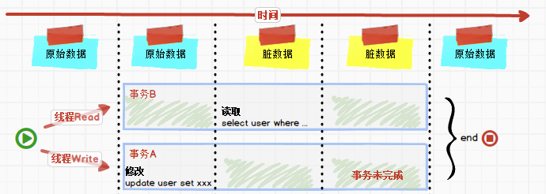
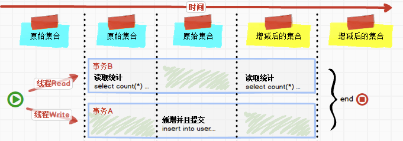
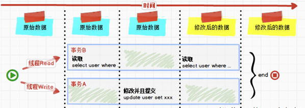
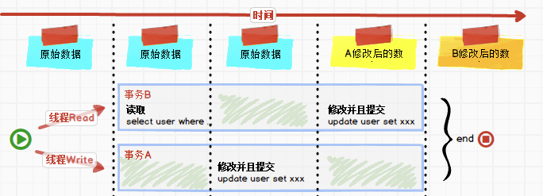
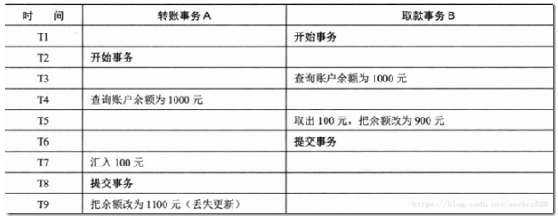
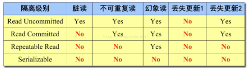

## 数据库并发问题

### 脏读

A 事务执行过程中，B 事务读取了 A 事务的修改。但是由于某些原因，A 事务没有完成提交，发生 RollBack 操作，则 B 事务所读取的数据就会是不正确的，这个未提交数据就是脏读（Dirty Read）。脏读产生的流程如下：

### 幻读

B 事务读取了两次数据，在这两次的读取过程中 A 事务添加了数据，B 事务的这两次读取出来的集合不一样。幻读看起来和不可重复读差不多，但幻读强调的集合的增减，而不是单独一条数据的修改。幻读产生的流程如下：

### 不可重复读

B 事务读取了两次数据，在这两次的读取过程中 A 事务修改了数据，B 事务的这两次读取出来的数据不一样。B 事务这种读取的结果，即为不可重复读（Nonrepeatable Read）。不可重复读的产生的流程如下：

### 第一类丢失更新

在完全未隔离事务的情况下，两个事务更新同一条数据资源，某一事务完成，另一事务异常终止，回滚造成第一个完成的更新也同时丢失 。第一类丢失更新的问题，在现代关系型数据库已经不会发生，这里不再累述。

### 第二类丢失更新

不可重复读有一种特殊情况，两个事务更新同一条数据资源，后完成的事务会造成先完成的事务更新丢失，这种情况就是第二类丢失更新。主流的数据库已经默认屏蔽了第一类丢失更新问题（即：后做的事务撤销，发生回滚造成已完成事务的更新丢失），但日常开发的时候仍需要特别注意第二类丢失更新。它产生的流程如下：

## 事务隔离级别

数据库系统必须具有隔离并发运行各个事务的能力，使它们不会相互影响，避免各种并发问题。一个事务与其他事务隔离的程度称为 `隔离级别`。SQL 标准中规定了多种事务隔离级别，不同隔离级别对应不同的干扰程度，隔离级别越高，数据一致性就越好，但数据库的并发性能越差。为了解决上面提及的数据库并发问题，主流关系型数据库都会提供四种事务隔离级别：

### 读未提交（Read Uncommitted）

在该隔离级别，所有事务都可以看到其他未提交事务的执行结果。该隔离级别是最低的隔离级别，虽然拥有超高的并发处理能力及很低的系统开销，但很少用于实际应用。因为采用这种隔离级别只能防止第一类更新丢失问题，不能解决脏读，幻读及不可重复读问题。

### 读已提交（Read Committed）

这是大多数数据库系统的默认隔离级别（但不是 MySQL 默认的），例如 Oracle 数据库。它满足了隔离的简单定义：一个事务只能看见已经提交事务所做的改变。这种隔离级别可以防止脏读问题，但会出现幻读及不可重复读问题。

### 可重复读（Repeatable Read）

这是 MySQL 的默认事务隔离级别，它确保在整个事务过程中，对同一条数据的读取结果是相同的，不管其他事务是否在对共享数据进行更新，也不管其他事务更新提交与否，这种隔离级别可以防止脏读及不可重复读的问题，但会出现幻读问题。

### 串行化（Serializable）

这是最高的事务隔离级别，它通过强制事务排序，使之不可能相互冲突，从而解决幻读、第二类更新丢失问题。在这个隔离级别，可以解决上面提到的所有并发问题，但可能导致大量的超时现象和锁竞争，通常数据库不会用这个隔离级别，可用其他的方案来解决这些问题，例如乐观锁和悲观锁。

### 案例说明

上图中是典型的第二类丢失更新问题，后果异常严重。当数据库隔离级别为读已提交（Read Committed）及以下隔离级别时，会出现不可重复读的现象。从上面的表格可以看出，当事务隔离级别设置为可重复读（Repeatable Read）时，可以避免不可重复读的现象出现。

### 总结说明

上述四种事务隔离级别会产生的问题如下（YES 表示存在对应的问题，NO 表示不存在对应的问题）：

各种关系型数据库对事务隔离级别的支持程度如下（YES 表示支持，NO 表示不支持）：

|                  | Oracle     | MySQL      |
| ---------------- | ---------- | ---------- |
| Read Uncommitted | NO         | YES        |
| Read Committed   | YES (默认) | YES        |
| Repeatable Read  | NO         | YES (默认) |
| Serializable     | YES        | YES        |

::: tip 提示
在 Spring 框架中，事务隔离级别可以通过 `@Transactional` 注解中的 `isolation` 属性定义。
:::
