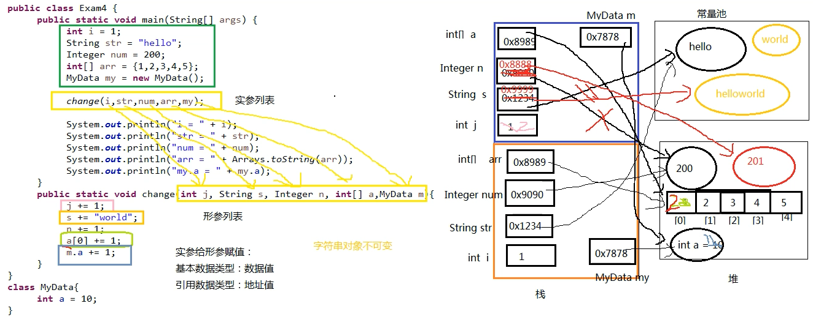
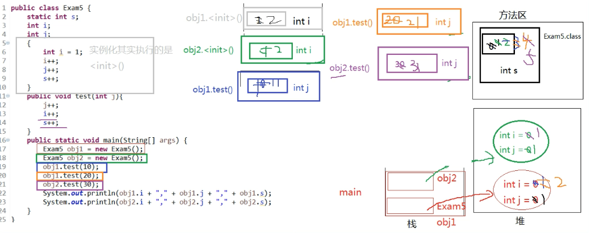

## 自增变量

### 面试案例一

> 案例代码

``` java
public class Test {
	public static void main(String[] args) {
		int a = 10;
		int varNum = 66;
		varNum = varNum++;
		System.out.println(varNum);
	}

	// 运行结果： 66
}
```

> 知识点

- 局部变量表(Local Variable Table)：一组变量值的存储空间，用于存放方法参数和方法内定义的局部变量
- 操作数栈：在内存分析的时候，都被放入了栈中，栈的特点是先进后出（LIFO），意味着先放进去的数，会被放在下面，后进去的数，一个一个垒在上面
- iconst 虚拟机指令：将常量加载到操作数栈上（入栈），可以用来将 int 类型的数字、取值在 -1 到 5 之间的整数压入栈中
- push 虚拟机指令：主要包括 bipush 和 sipush，它们的区别在于接收数据类型的不同，bipush 接收 8 位整数作为参数，sipush 接收 16 位整数，它们都可以将参数压入栈
- istore_n 虚拟机指令：从操作数栈中弹出一个整数，并把它赋值给第 n 个局部变量
- xload_n 虚拟机指令：表示将第 n 个局部变量压入操作数栈，比如 iload_1、fload_0、aload_0 等指令，其中 aload_n 表示将一个对象引用压栈
- iinc 虚拟机指令：对给定的局部变量做自增操作，这条指令是少数几个执行过程中完全不修改操作数栈的指令；它接收两个操作数：第 1 个局部变量表的位置，第 2 个位累加数。比如常见的 i++ 就会产生这条指令

> 分析过程

下面将使用 `javap` 工具来分析问题，`javap` 是 JDK 自带的反汇编器，可以查看 Java 编译器生成的字节码。通过它，可以对照源代码和字节码，从而更了解编译器内部的工作过程。执行以下命令：

- 编译命令： `javac Test.java`
- 反汇编命令： `javap -c Test`
- `javap` 反汇编后，会输出以下内容，其中 `main()` 里是 `varNum = varNum++` 的执行过程

```
Compiled from "Test.java"
public class Test {
  public Test();
    Code:
       0: aload_0
       1: invokespecial #1                  // Method java/lang/Object."<init>":()V
       4: return

  public static void main(java.lang.String[]);
    Code:
       0: bipush        10
       2: istore_1
       3: bipush        66
       5: istore_2
       6: iload_2
       7: iinc          2, 1
      10: istore_2
      11: getstatic     #2                  // Field java/lang/System.out:Ljava/io/PrintStream;
      14: iload_2
      15: invokevirtual #3                  // Method java/io/PrintStream.println:(I)V
      18: return
}
```

结合上面铺垫的虚拟机指令，这里讲解一下 `main()` 里的 0 -11 步骤的工作流程：

- 0: bipush 10 将参数 10 压入操作数栈
- 2: istore_1 从操作数栈中弹出一个数，赋给第一个局部变量（a）
- 3: bipush 66 将参数 66 压入操作数栈
- 5: istore_2 从操作数栈中弹出一个数，赋给第二个局部变量（varNum）
- 6: iload_2 将第二个局部变量（varNum）的值入栈，此时操作数栈的栈顶值为 66
- 7: iinc 2, 1 对第二个局部变量（varNum）做自增 1 操作，意味着局部变量 varNum 的值变为 67；特别注意，这里并没有修改操作数栈里的任何内容
- 10: istore_2 从操作数栈的栈顶弹出一个数（即 66）赋给第二个局部变量（varNum），意味局部变量 varNum 的值又变回 66
- 11: iload_2 将第二个局部变量（varNum）的值入栈，此时操作数栈的栈顶值为 66
- 最终打印结果就是：66

> 案例总结

Java Lang Spec 在文中也提到：

- 自增运算符 `++` 的优先级大于赋值运算符 `=`
- 原文描述为 `The result of the postfix increment expression is not a variable, but a value`，翻译过来就是：后 `++` 符表达式的结果是个值而不是一个变量

### 面试案例二

> 案例代码

``` java
public class Test {

    public static void main(String[] args) {
        int i = 1;
        i = i++;
        int j = i++;
        int k = i + ++i * i++;
        System.out.println("i=" + i);
        System.out.println("j=" + j);
        System.out.println("k=" + k);
    }

}
```

> 分析过程

``` java
public class Test {

    public static void main(String[] args) {
        int i = 1;
        i = i++; // i=1
        int j = i++; // j=1, i=2
        int k = i + ++i * i++; // k= 2 + 3 * 3 = 11, i=4
        System.out.println("i=" + i); // 4
        System.out.println("j=" + j); // 1
        System.out.println("k=" + k); // 11
    }

    // 运行结果： 4 1 11

}
```

上述代码通过 `javap` 工具反编译后，得到的字节码如下：


```
Compiled from "Test.java"
public class Test {
    public Test();
    Code:
        0: aload_0
        1: invokespecial #1                  // Method java/lang/Object."<init>":()V
        4: return

    public static void main(java.lang.String[]);
    Code:
        0: iconst_1
        1: istore_1
        2: iload_1
        3: iinc          1, 1
        6: istore_1
        7: iload_1
        8: iinc          1, 1
        11: istore_2
        12: iload_1
        13: iinc          1, 1
        16: iload_1
        17: iload_1
        18: iinc          1, 1
        21: imul
        22: iadd
        23: istore_3
        24: getstatic     #2                  // Field java/lang/System.out:Ljava/io/PrintStream;
        27: new           #3                  // class java/lang/StringBuilder
        30: dup
        31: invokespecial #4                  // Method java/lang/StringBuilder."<init>":()V
        34: ldc           #5                  // String i=
        36: invokevirtual #6                  // Method java/lang/StringBuilder.append:(Ljava/lang/String;)Ljava/lang/StringBuilder;
        39: iload_1
        40: invokevirtual #7                  // Method java/lang/StringBuilder.append:(I)Ljava/lang/StringBuilder;
        43: invokevirtual #8                  // Method java/lang/StringBuilder.toString:()Ljava/lang/String;
        46: invokevirtual #9                  // Method java/io/PrintStream.println:(Ljava/lang/String;)V
        49: getstatic     #2                  // Field java/lang/System.out:Ljava/io/PrintStream;
        52: new           #3                  // class java/lang/StringBuilder
        55: dup
        56: invokespecial #4                  // Method java/lang/StringBuilder."<init>":()V
        59: ldc           #10                 // String j=
        61: invokevirtual #6                  // Method java/lang/StringBuilder.append:(Ljava/lang/String;)Ljava/lang/StringBuilder;
        64: iload_2
        65: invokevirtual #7                  // Method java/lang/StringBuilder.append:(I)Ljava/lang/StringBuilder;
        68: invokevirtual #8                  // Method java/lang/StringBuilder.toString:()Ljava/lang/String;
        71: invokevirtual #9                  // Method java/io/PrintStream.println:(Ljava/lang/String;)V
        74: getstatic     #2                  // Field java/lang/System.out:Ljava/io/PrintStream;
        77: new           #3                  // class java/lang/StringBuilder
        80: dup
        81: invokespecial #4                  // Method java/lang/StringBuilder."<init>":()V
        84: ldc           #11                 // String k=
        86: invokevirtual #6                  // Method java/lang/StringBuilder.append:(Ljava/lang/String;)Ljava/lang/StringBuilder;
        89: iload_3
        90: invokevirtual #7                  // Method java/lang/StringBuilder.append:(I)Ljava/lang/StringBuilder;
        93: invokevirtual #8                  // Method java/lang/StringBuilder.toString:()Ljava/lang/String;
        96: invokevirtual #9                  // Method java/io/PrintStream.println:(Ljava/lang/String;)V
        99: return
}
```

> 案例总结

- 赋值操作符 `=` 最后计算
- 赋值操作符 `=` 右边的从左到右加载值依次压入操作数栈
- 实际先算哪个，看运算符的优先级
- 自增、自减操作都是直接修改变量的值，不经过操作数栈
- 在最后的赋值之前，临时结果都是存储在操作数栈中

## 方法参数传递

### 面试案例一

> 案例代码

``` java
public class Example {

	public static void main(String[] args) {
		int i = 1;
		String str = "hello";
		Integer num = 200;
		int[] arr = { 1, 2, 3, 4, 5 };
		MyData my = new MyData();
		change(i, str, num, arr, my);

		System.out.println("i = " + i);
		System.out.println("str = " + str);
		System.out.println("num = " + num);
		System.out.println("arr = " + Arrays.toString(arr));
		System.out.println("my.a = " + my.a);
	}

	public static void change(int j, String s, Integer n, int[] a, MyData data) {
		j += 1;
		s += "world";
		n += 1;
		a[0] += 1;
		data.a += 1;
	}

}

class MyData {
	int a = 10;
}
```

运行结果

```
i = 1
str = hello
num = 200
arr = [2, 2, 3, 4, 5]
my.a = 11
```

> 分析过程



> 知识点

- 形参是基本数据类型时
	- 传递数据值
- 实参是引用数据类型
	- 传递地址值：类对象类型、数组
	- 特殊的类型：String、包装类（如 Integer）等对象拥有不可变性

## 局部变量与成员变量

### 面试案例一

> 案例代码

``` java
public class VariableDemo {

	static int s;
	int i;
	int j;

	{
		int i = 1;
		i++;
		j++;
		s++;
	}

	public void test(int j) {
		i++;
		j++;
		s++;
	}

	public static void main(String[] args) {
		Example obj1 = new Example();
		Example obj2 = new Example();
		obj1.test(10);
		obj1.test(20);
		obj2.test(30);
		System.out.println(obj1.i + ", " + obj1.j + ", " + obj1.s);
		System.out.println(obj2.i + ", " + obj2.j + ", " + obj2.s);
	}

}
```

运行结果

```
2, 1, 5
1, 1, 5
```

> 分析过程



> 知识点

- 变量的分类
	- 局部变量
	- 成员变量：包括类变量、实例变量
- 局部变量与成员变量的区别
  - 声明的地方
  	- 局部变量声明的地方：方法体 {} 中、形参、代码块 {} 中
  	- 成员变量声明的地方：类中方法外
  		- 类变量：有 static 修饰
  		- 实例变量：没有 static 修饰
  - 修饰符的使用
    - 局部变量：final
    - 成员变量：public、protected、private、final、static、volatile、transient
  - 值存储的位置
    - 局部变量：栈
    - 成员变量
      - 类变量：方法区
      - 实例变量：堆
  - 默认值
    - 局部变量：没有默认值
    - 成员变量：有默认值，如 `int` 类型的成员变量的默认值是 0
  - 作用域
    - 局部变量：从声明处开始，到所属的 `}` 结束
    - 成员变量
      - 类变量：在当前类中通过 `类名.` 访问，在其他类中通过 `类名.` 或者 `对象名.` 访问
      - 实例变量：在当前类中通过 `this.`，在其他类中通过 `对象名.` 访问
  - 生命周期
    - 局部变量：每一个线程，每一次调用执行都是新的生命周期
    - 成员变量
      - 类变量：随着类的初始化而初始化，随着类的卸载而消亡，该类的所有对象的类变量是共享的
      - 实例变量：随着对象的创建而初始化，随着对象的被回收而消亡，每一个对象的实例变量都是互相独立的
- 当局部变量与成员变量重名时，如何区分？
  - 局部变量与类变量重名：在类变量前加 `类名.`
  - 局部变量与实例变量重名：在实例变量前加 `this.`
- 非静态代码块的执行：每次创建实例对象时都会执行
- 就近原则
