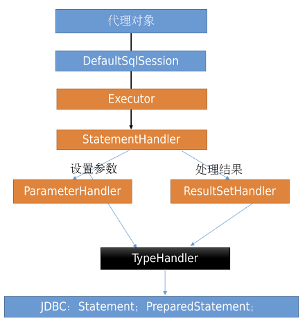

## MyBatis 四大对象

### 四大对象的简介

MyBatis 的四大对象包括：Executor、StatementHandler、ParameterHandler、ResultSetHandler。四大对象的工作职责如下：

- `Executor（执行器）`：负责整个 SQL 执行过程的总体控制
- `StatementHandler（语句处理器）`：负责和 JDBC 层交互，包括预编译 SQL 语句和执行 SQL 语句，以及调用 `ParameterHandler` 设置参数
- `ParameterHandler（参数处理器）`：负责设置预编译参数
- `ResultSetHandler（结果集处理器）`：负责将 JDBC 查询结果映射到 JavaBean 对象

### 四大对象的工作流程

## 一级缓存失效的四种场景

- 1) 使用不同的 `SqlSession` 进行查询
- 2) 同一个 `SqlSession`，但是查询条件不同
- 3) 同一个 `SqlSession`，但是在两次查询期间手动清空了一级缓存
- 4) 同一个 `SqlSession`，但是在两次查询期间执行了任何一次增删改操作

## 解决实体类的属性名与表的字段名不一致

三种解决方法如下：

- 1) 编写 SQL 语句时使用字段别名
- 2) 在 MyBatis 的全局配置文件中开启驼峰命名规则
- 3) 在 Mapper 映射文件中使用 `resultMap` 来自定义映射规则
