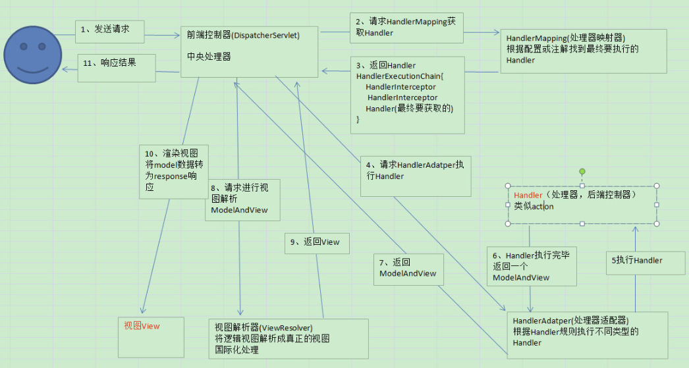

## Spring MVC 的工作流程

### 工作原理



### 各大组件

- DispatcherServlet：中央控制器，也称为前端控制器，它是整个请求响应的控制中心，组件的调用由它统一调度
- HandlerMapping：处理器映射器，它根据用户访问的 URL 映射到对应的后端处理器 Handler。也就是说它知道处理用户请求的后端处理器，但是它并不执行后端处理器，而是将后端处理器告诉给中央处理器
- HandlerAdapter：处理器适配器，它调用后端处理器中的方法，返回逻辑视图 ModelAndView 对象
- ViewResolver：视图解析器，将 ModelAndView 逻辑视图解析为具体的视图（如 JSP）
- Handler：后端处理器，对用户具体请求进行处理，也就是 Controller 类

### 工作流程

- 1）用户向服务端发送一次请求，这个请求会先到中央控制器 DispatcherServlet（前端控制器）
- 2）DispatcherServlet 接收到请求后会调用 HandlerMapping 处理器映射器。由此得知，该请求该由哪个 Controller 来处理（此时并未调用 Controller，只是得知）
- 3）DispatcherServlet 调用 HandlerAdapter 处理器适配器，告诉处理器适配器应该要去执行哪个 Controller
- 4）HandlerAdapter 处理器适配器去执行 Controller 并得到 ModelAndView （数据和视图），并层层返回给 DispatcherServlet
- 5）DispatcherServlet 将 ModelAndView 交给 ViewReslover 视图解析器解析，然后返回真正的视图
- 6）DispatcherServlet 将模型数据填充到视图中
- 7）DispatcherServlet 将结果响应给用户

### 处理模型数据的方式

- 处理模型数据的方式一：将 Controller 中方法的返回值设置为 ModelAndView
- 处理模型数据的方式二：将 Controller 中方法的返回值设置为 String，在方法的入参中传入 Map、Model 或者 ModelMap
- 上述的两种方式，最终都会被 Spring MVC 转换为一个 ModelAndView 对象

## Spring MVC 中解决请求乱码

### 解决 POST 请求乱码

``` xml
<!-- 配置 SpringVMC 的字符编码过滤器 -->
<filter>
  	<filter-name>encoding</filter-name>
  	<filter-class>org.springframework.web.filter.CharacterEncodingFilter</filter-class>
  	<init-param>
  		<param-name>encoding</param-name>
  		<param-value>utf-8</param-value>
  	</init-param>
  	<init-param>
  		<param-name>forceRequestEncoding</param-name>
  		<param-value>true</param-value>
  	</init-param>
  	<init-param>
  		<param-name>forceResponseEncoding</param-name>
  		<param-value>true</param-value>
  	</init-param>
  </filter>

  <filter-mapping>
  	<filter-name>encoding</filter-name>
  	<url-pattern>/*</url-pattern>
  </filter-mapping>
```

### 解决 GET 请求乱码

方法一，通过 Java 代码手动指定字符编码：

``` java
String name = new String (resuest.getParameter("name").getBytes("ISO8859-1"), utf-8);
```

方法二，通过配置 Tomcat 的 `server.xml` 配置文件指定字符编码：

``` xml
<Connector connectionTimeout="20000" port="8080" protocol="HTTP/1.1" redirectPort="8443" URIEncoding="UTF-8"/>
```
